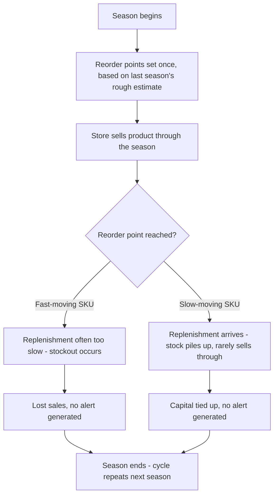
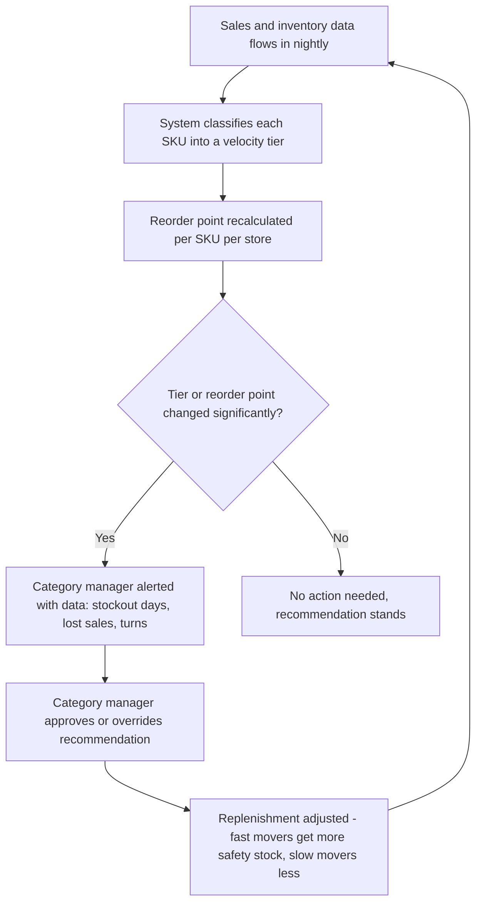

# Process Map — Velocity-Based Inventory Rebalancing

## As-Is Process (Current State)

**Pain points identified**
- Reorder points are set once per season and never revisited against actual in-season velocity
- No alert exists when a fast-mover is stocking out or a slow-mover is overstocking — both go unnoticed until a manual review
- The same static reorder logic is applied regardless of how differently individual SKUs actually sell

## To-Be Process (Redesigned)

**Key changes**
- Reorder points recalculate continuously from real sales data instead of once a season
- Category managers are proactively alerted only when something has meaningfully changed, rather than needing to notice a problem themselves
- The loop is continuous — each recalculation feeds the next, rather than resetting only at season boundaries

## Estimated Impact

| Stage | As-Is | To-Be Target |
|---|---|---|
| Fast-mover avg stockout days/month | 8.1 | ≤4.0 |
| Slow-mover avg inventory (5 SKUs, 4 stores, snapshot) | ≈$41,984 | ≈$29,400 (-30%) |
| Annualized lost sales from stockouts | $887,139 | ≈$443,500 (-50%) |
